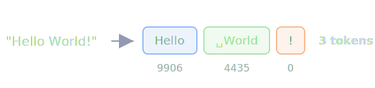
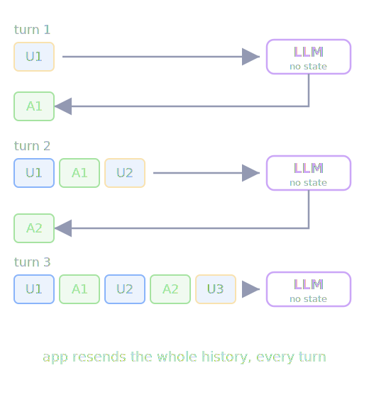
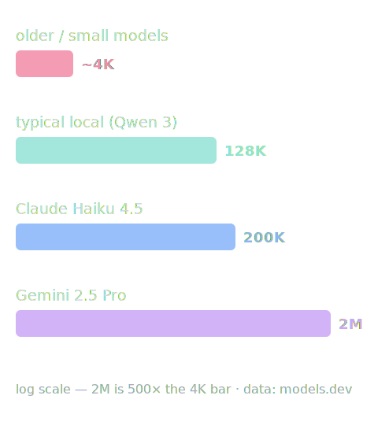
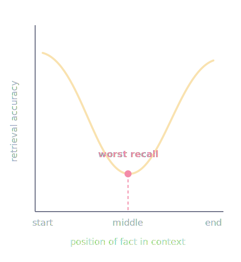
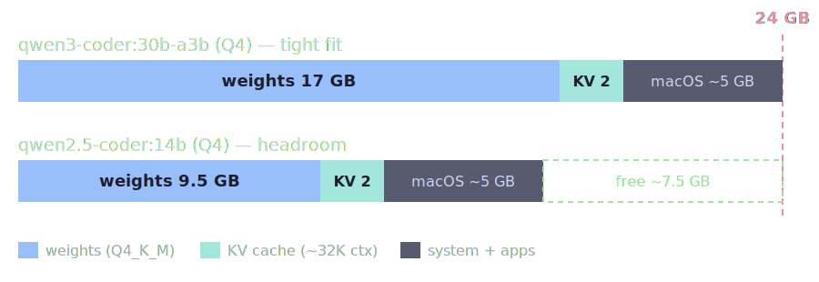
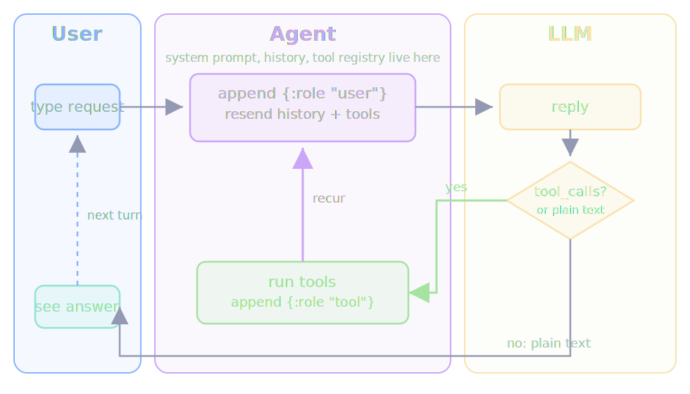

# LLMs & Coding Agents

Build a coding agent from scratch in Clojure

Julian Visser

---

## Goal

Demo

---

# Block 1 — LLM fundamentals

---

## What an LLM is

- Next-token predictor over a vocabulary

---

## Tokens — the currency



- **Vocabulary**: words/subwords/chars → numbers
- **Billed per token** — input and output priced separately
- Same text, different token count per provider
- Rare words / less-common languages cost **more** tokens

---

## Tokenizer demo

`src/token/demo.clj`

```bash
clojure -M -m token.demo "Clojure makes data explicit."
ollama run gemma4:e2b-mlx --verbose "Why is the sky blue?"
```

```text
input: Clojure makes data explicit.
chars: 28
tokens: 7
ids: (34 72013 627 4787 1238 23141 13)
decoded: Clojure makes data explicit.
```

- In Claude Code, run `/context` to see current context usage / token budget

---

## When does generation stop?

---

## LLM statelessness



- Every request starts from zero
- App **resends whole history** every turn
- **App** owns memory, not the model

---

## Context window



- All input + output tokens visible **at once**
- Hard limit
- More context = more KV cache memory

---

## Lost in the middle



- Performance **degrades** as context grows
- Attention favors **start and end**

---

# An agent

A loop that resends state to a stateless model and executes what it asks for.

Text -> Doing something

---

# Block 2 — The runnable loop

---

Outer shell first: read line → echo → repeat.

<div style="display:grid;grid-template-columns:2fr 1fr;gap:1.5rem">
<div>

```clojure
(def exit-commands #{"quit" "exit"})

(defn chat-loop []
  (loop []
    (print "> ") (flush)
    (let [input (read-line)]
      (when-not (or (nil? input) (exit-commands input))
        (println input)              ; ← the LLM goes here later
        (recur)))))
```

</div>
<div>

```
> Hi
"Hi"
> 42
"42"
> quit
```

</div>
</div>

---

# Block 3 — Connect the LLM

---

## Choosing a local model

- **Params** (7B/14B/30B)
- **Quantization**: 4-bit (Q4_K_M). Rule: `params(B) × 0.6 ≈ GB`

### What params mean

- `7B` / `14B` / `32B` = billions of learned weights
- More params = **usually** better
- But also more memory

---

## RAM + quantization

Models ship at **16 bits (2 bytes) per parameter** (BF16/FP16). Quantization maps weights to fewer discrete values — with quality cost.

```
original: [0.12, -0.87, 0.43, ...]   ← FP16, 2 bytes each
quantized: [9, 1, 11, ...]            ← 4-bit index, 0.5 bytes each
+ scale + min                         ← stored once per block
```

| Precision | Bytes/param | 7B model |
|-----------|-------------|----------|
| FP32 (training baseline) | 4 | ~28 GB |
| FP16 / BF16 (as shipped) | 2 | ~14 GB |
| 4-bit (Q4_K_M) | ~0.6 | ~4 GB |

---

## Does it fit?



Memory = weights + KV cache (grows with context) + what macOS keeps for itself.

---

## Ollama

Demo

---

## The Ollama API

Plain HTTP + JSON on `localhost:11434`.

```bash
curl localhost:11434/api/generate -d '{"model": "gemma4:e2b-mlx", "prompt": "Why is the sky blue?", "stream": false}'
```

- `/api/generate` — bare prompt, no history
- `/api/chat` — `messages` + `tools`
- `stream` defaults `true` → send `:stream false`

---

`agent.llm/call-llm` — clj-http POST, jsonista parse. Hardcode model + endpoint.

```clojure
(defn call-llm
  "Sends a conversation (vector of message maps) to Ollama.
   Returns the assistant's reply as a string."
  [messages]
  (let [body     {:model "gemma4:e2b-mlx" :messages messages :stream false}
        response (http/post "http://localhost:11434/api/chat"
                            {:body (json/write-value-as-string body)})]
    (-> (:body response)
        (json/read-value mapper)
        (get-in [:message :content]))))
```

---

# Block 4 — History

---

Payoff: **history is an accumulator**. Send the whole vector every request.

```clojure
(loop [history [(system-message)]]
  (prompt)
  (let [input   (read-line)
        history (conj history {:role "user" :content input})
        answer  (llm/call-llm history)]
    (println answer)
    (recur (conj history {:role "assistant" :content answer}))))
```

App owns memory, not the model.

---

# Block 5 — System prompts

---

- Highest-priority instruction in the request
- Sets role, boundaries, tone, and task framing
- Sent again on every stateless turn
- Same user prompt + different system prompt = different behavior

---

# Copilot Demo

```
## Settings
"github.copilot.chat.agentDebugLog.fileLogging.enabled": true
```

Run Developer: `Open Agent Debug Logs` from the Command Palette.

---

# Block 6 — Tool calling

---

## The loop



- Pass `tools` → model replies with `tool_calls`

---

`agent.core/agentic-turn` — recur-until-plain-text. The whole agent:

```clojure
(loop [msgs (conj history {:role "user" :content input})]
  (let [reply (llm/call-llm-with-tools msgs (tools/tools-for-api))
        msgs' (conj msgs reply)]
    (if-let [calls (seq (:tool_calls reply))]
      (recur (reduce (fn [acc {{:keys [name arguments]} :function}]
                       (conj acc {:role      "tool"
                                  :tool_name name
                                  :content   (tools/run name arguments)}))
                     msgs' calls))
      (:content reply))))
```

---

Adding a tool = write a fn + register it. The loop is untouched:

```clojure
"bash"
{:name        "bash"
 :description "Runs a bash command. Returns stdout, or stderr on failure."
 :parameters  {:type       "object"
               :properties {:command {:type "string"}}
               :required   ["command"]}
 :fn          (fn [{:keys [command]}] (bash command))}
```

Then `read-file` / `write-file` / `edit-file` for safe explicit edits.

⚠️ `bash` runs arbitrary commands with **your** permissions. Sandbox only — this is why real agents ask first.

---

## Permissions

```
User → [App] → LLM → tool_calls → [App] → Tools → filesystem / shell / web
                 ↑                    ↑
           decides WHAT           decides IF
```

LLM **requests** tool calls. App **executes** them. The gate is yours.

---

## Three layers of permission

| Layer | Mechanism | Reliability |
|-------|-----------|-------------|
| Behavioral | System prompt: "ask before running bash" | Soft — LLM may comply |
| Application gate | Intercept `tool_calls`, prompt human before executing | Hard — LLM can't bypass |
| OS / sandbox | File permissions, containers, network rules | Hard — enforced by kernel |

---

## App gate

```clojure
(defn- confirm-tool-call [tool-name args]
  (println (str "\n[permission] " tool-name " " args))
  (print "Run? (y/n) > ") (flush)
  (= "y" (clojure.string/trim (read-line))))
```

```clojure
;; inside agentic-turn, before tools/run:
result (if (not (confirm-tool-call fn-name args))
         (str "User denied: " fn-name)
         (try (tools/run fn-name args)
              (catch Exception e (str "Tool error: " (.getMessage e)))))
```

Denied result is fed back to the LLM as a tool message — it sees `"User denied: bash"` and responds accordingly.

---

# Block 7 — Where this goes

---

## MCP, skills & real agents

- MCP — modelcontextprotocol.io
- Skills - agentskills.io
- agents.md
- Commands: `/clear` (blank slate) vs `/compact` (LLM summary)
